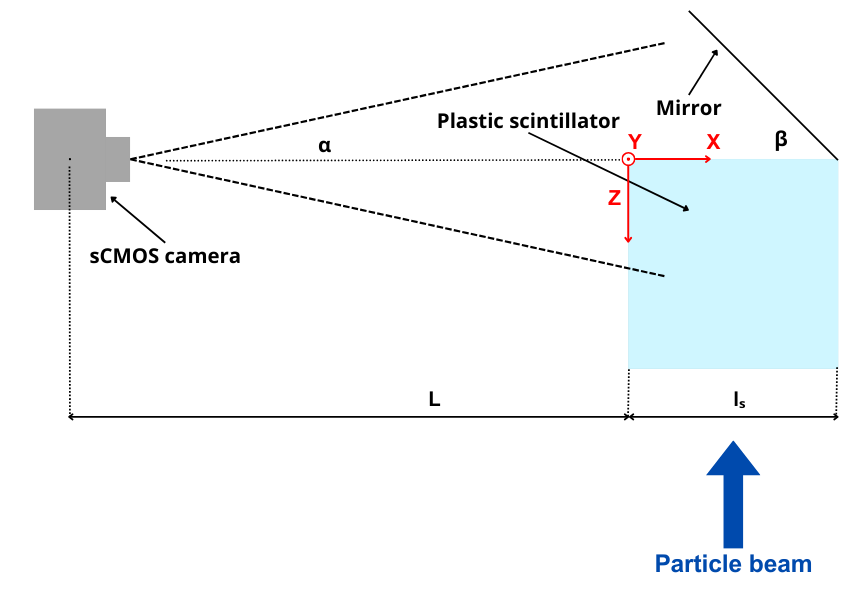
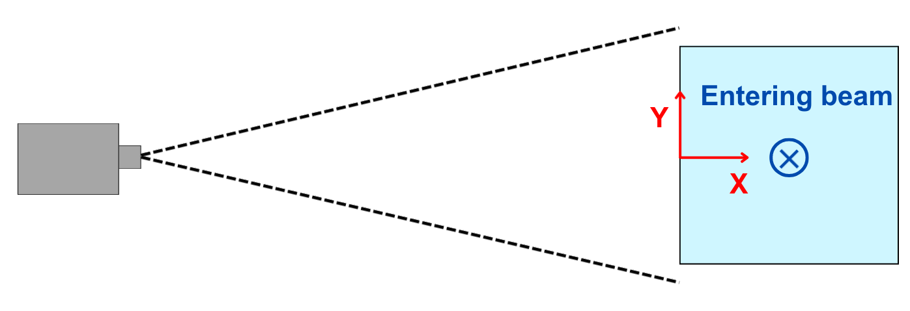

# CNAO He-check analysis
## Project description

This project analyzes .tif images obtained from a camera setup designed to study the Bragg peak position of a proton beam in a scintillator. The Bragg peak is the point where the proton beam releases the maximum amount of energy. The data were acquired at CNAO (Centro Nazionale di Adroterapia Oncologica) in Pavia within the context of the He-check project. Further information about the project and the calculation used to perform the analisys can be found in the file CNAO_He_check.pdf .

### Experimental Setup

The setup consists of the following components:

1. **Scientific CMOS Camera**: captures images of the scintillator.
2. **Plastic cubic scintillator**: positioned at a fixed distance L from the camera, with one side aligned with the camera.
3. **Mirror**: placed adjacent to the scintillator to reflect its lateral side towards the camera.
The proton beam is directed laterally at the scintillator from the side opposite the mirror.
To help visualize the system, refer to the following images:

<p align="center">
  
  <br><em>Image 1: Top view schematic of the setup </em>
</p>

<p align="center">
  
  <br><em>Image 2: Lateral view schematic of the setup with the proton beam entering the page</em>
</p>

When the proton beam hits the scintillator the protons release energy in the scintillator, creating a visible track. The mirror reflects an image of the lateral side of the scintillator, showing the spread of the Bragg peak as a spot.
Each .tif image captures:
- A track within the scintillator indicating the energy release.
- A spot in the mirror representing the lateral spread of the Bragg peak.

### Reconstruction Process

The analysis process is divided into two main parts:

1. **Image Analysis**:
   Determines the pixels corresponding to the Bragg peak position with two different methods:
   - **Integration Method**:
     - Integrates luminosity along the y-axis to obtain the range of the particle and x positions.
     - Integrates luminosity along the x-axis to obtain the y position.
   - **Clusterization Method**:
     - Find the two clusters corresponding to the track in the scintillator and spot in the mirror.
     - Find the center spot in the mirror and Bragg peak position from the track in the scintillator.

2. **Position reconstruction**:
   - Solves numerically a system of equations that includes refraction effects to reconstruct the exact X and Y position of the Bragg peak and the value of the range in millimeters, starting from the pixels previously identified. The X and Y position are given in the reference frame represented in [Image 2](#experimental-setup).

### Data Structure

The data are composed of three different .tif files, referred to three different proton ranges in water (30 mm, 60 mm and 101 mm), containing 9 individual .tif images. These 9 images represent different frames captured with protons at the same range but at different X and Y positions. As long with images with beam, some background images has been taken. The data can be downloaded as explained in [Downloading data](#downloading-data).

## Files and folders description

   - [app.py](./app.py) contains the main code
   - the [templates](./templates) folder contains the .html files corresponding to different pages that open when running the project
   - the [static](./static) folder contains some results of the analysis and a file results_protonrange.txt with the X, Y and range values in mm obtained with the two methods
   - the [requirement.txt](./requirements) file is the list of the prerequisites necessary to run the code locally (see [Running Locally](#running-locally) and used by the Dockerfile to build the container
   - the [status.txt](./status.txt) file contains real-time status updates of the running program
   - the [run_py.sh](./run_py.sh) and [run_docker.sh](./run_docker.sh) scripts start the application locally and build the Docker image and start the application inside the container respectively
   - [Dockerfile](./Dockerfile) is the dockerfile that creates the docker image necessary to run the application in the docker container

## Installation

### Prerequisites

The code can be runned with docker like explained in [Running with Docker](#running-with-docker). In this case only **Docker** is needed.  
To run the project locally instead, you need to have Python installed with the dependecies that you can find in the file [requirements.txt](./requirements.txt).
### Downloading Data

Download the "images" and "bkg" folders from the following links and extract them in the project directory:

- [Link to images](https://drive.google.com/uc?export=download&id=1JeHN8w-iI4_kpuRV74B0942E5eZku1Kn)

- [Link to background images](https://drive.google.com/uc?export=download&id=1zLphs8y7AyetAFWaUnxOKZLpX2sGCNr6)

Inside the "bkg" folder there are all the background images used to clean and process the images to analyze. In teh "images" folder there are the .tif images correspondig to the different ranges of proton beams.
## Usage


### Running Locally

If you have all the prerequisites mentioned in [Prerequisites](#prerequisites) installed, you can run the application with the following command:


   ```bash
   chmod +x run_py.sh
   ```
   ```bash
   ./run_py.sh
   ```

This script will start the application locally.

### Running with Docker

To run the project using Docker, execute the following command:

```bash
chmod +x run_docker.sh
```
```bash
./run_docker.sh
```

This script will build the Docker image and start the application inside the container.
In both cases, a link will appear in the terminal to open the application's interface. Within the interface, users can select images for analysis, specifying the proton range of interest. Once the range is selected, the application will initiate image analysis, and the progress will be displayed in the interface. Upon completion, results will be presented, including a schematic of the scintillator displaying the X and Y positions of the beam for the two different analysis methods, along with range values calculated for each .tif image and the mean value. From this page, users can choose to shut down the application, download the results, or initiate another analysis.


